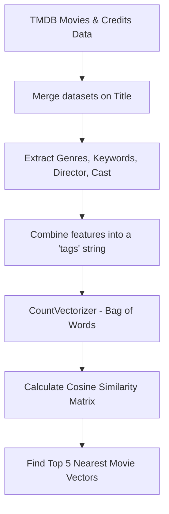

# Movie Recommender System

[](https://github.com/ramanan-2735/movie-recommender-dma-mini-project/actions/workflows/python-ci.yml)
[](https://opensource.org/licenses/MIT)

A Flask-based web application that implements a content-based movie recommender system using machine learning. The model analyzes metadata—including genres, keywords, cast, and crew—of the TMDB 5000 Movies dataset to identify similar films using cosine similarity.

---

## 🚀 Key Features

- **Content-Based Filtering:** Recommends movies by analyzing metadata (genres, keywords, directors, and top cast).
- **Text Vectorization:** Employs `CountVectorizer` (Bag of Words model) to convert textual tags into sparse vector spaces.
- **Similarity Computation:** Uses `cosine_similarity` to measure angular distances between movie vectors.
- **Interactive Flask UI:** Clean web interface allowing users to select a movie and view the top recommendations instantly.
- **Fallback Simulation:** Automatically generates dummy dataset templates if the large TMDB raw dataset is missing.

---

## 🛠️ Tech Stack

- **Backend / Web Server:** Flask
- **Data Engineering:** Pandas, Numpy
- **Machine Learning Model:** Scikit-Learn
- **Model Storage:** Pickle (serialization of processed dataframes and similarity matrices)

---

## 📐 Algorithmic Flow



---

## 📁 Repository Directory Structure

```
movie-recommender-dma-mini-project/
├── templates/             # HTML templates for Flask rendering
│   └── index.html         # Main dashboard page
├── app.py                 # Flask server and recommendation router
├── model.py               # ML preprocessing, vectorization, and pickle generation
├── requirements.txt       # Python package dependencies
└── .gitignore             # Python and model exclusion rules
```

---

## ⚙️ Installation & Usage

### Prerequisites
- Python 3.9 or higher installed.

### 1. Clone the Repository
```bash
git clone https://github.com/ramanan-2735/movie-recommender-dma-mini-project.git
cd movie-recommender-dma-mini-project
```

### 2. Set Up Virtual Environment (Recommended)
```bash
python -m venv venv
# On Windows
venv\Scripts\activate
# On macOS/Linux
source venv/bin/activate
```

### 3. Install Dependencies
```bash
pip install -r requirements.txt
```

### 4. Setup TMDB Dataset (Optional)
Place the TMDB 5000 dataset files (`tmdb_5000_movies.csv` and `tmdb_5000_credits.csv`) in the root directory. If missing, running `model.py` will generate dummy datasets to verify execution.

### 5. Build the Recommendation Model
Execute the preprocessing model script to clean data and serialize the recommendation matrices:
```bash
python model.py
```
This generates `movies.pkl` and `similarity.pkl`.

### 6. Run the Application
Launch the Flask development server:
```bash
python app.py
```
Open your browser and navigate to `http://127.0.0.1:5000/`.

---

## 📄 License

Licensed under the MIT License. See [LICENSE](LICENSE) for details.
